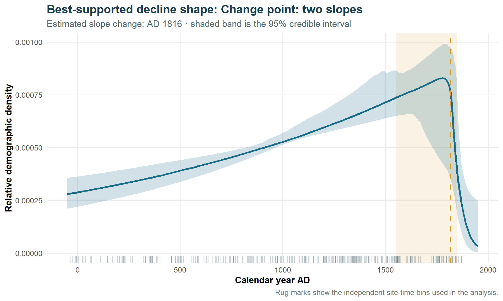

# Kev-Carbon

## Bayesian modelling of archaeological radiocarbon data

Kev-Carbon is a reproducible R workflow for investigating temporal
change in archaeological radiocarbon datasets using Bayesian models.

The project develops and compares alternative models of demographic
change, including single-slope, change-point and logistic-transition
models implemented in NIMBLE.

## Research aims

The project asks:

- Can changes in archaeological radiocarbon evidence be quantified
  probabilistically rather than inferred from summed probability
  distributions alone?
- Do the data support continuous change, discrete change points, or
  smoother demographic transitions?
- How sensitive are inferred trajectories to chronological uncertainty,
  model specification and analytical window?

## Methods

The workflow uses:

- R
- NIMBLE
- Bayesian MCMC
- radiocarbon calibration
- posterior predictive trajectories
- WAIC model comparison
- convergence diagnostics
- sensitivity analysis

## Current model comparison

Three alternative demographic models are implemented within a common
Bayesian framework:

1. **Single-slope model** — estimates a continuous temporal trend.
2. **Change-point model** — allows the rate of change to differ before
   and after an estimated temporal breakpoint.
3. **Logistic-transition model** — represents gradual transition
   between demographic regimes.

Models are compared using WAIC alongside posterior diagnostics and
archaeological interpretation.

## Repository structure

- `aus_decline_models/` — Bayesian demographic model comparison
- `analysis/` — supporting analyses and reports
- `app/` — interactive Shiny interface
- `data/` — project data
- `figures/` — figures used in documentation
- `archive/` — superseded development material

## Interpretation

Radiocarbon-date frequency is treated as an archaeological proxy rather
than a direct census of past population size. Results therefore require
interpretation in relation to sampling, preservation, calibration and
the archaeological processes generating the dated record.

## Status

Active research software development.

The repository is being developed as part of ongoing methodological
research into Bayesian chronological modelling and archaeological
demography.
